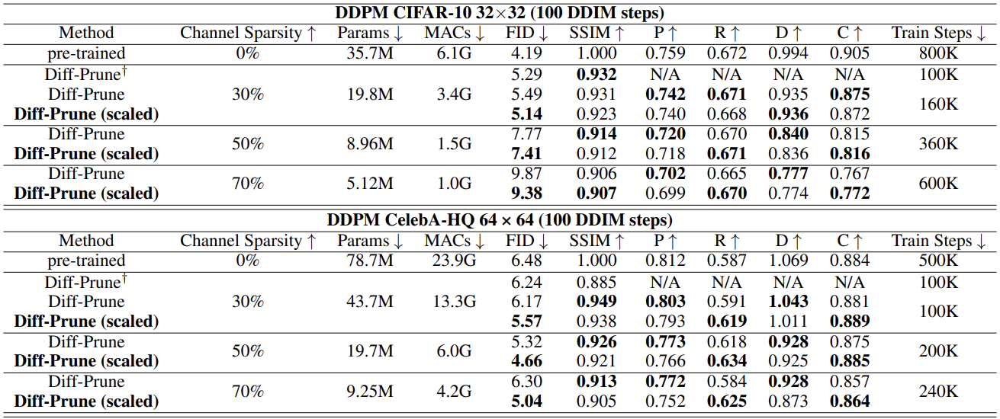

# DDPM Compression

### Main Quantitative Results in the Paper

<div style="text-align: center;">
  
</div>


## Usage

### Installation

```
conda create -n diff-prune -y python=3.9
conda activate diff-prune
conda install pytorch==1.12.1 torchvision==0.13.1 torchaudio==0.12.1 -c pytorch -y
pip install -r requirements.txt
```

### Prune & Finetune Models


```
# For CIFAR10, pr=0.3 case

cd ddpm_exp

# Prune
bash scripts/exp/cifar_our_prune_pr0.3_thr0.05.sh # the pre-trained model and data will be automatically prepared

# Scaling
bash scripts/exp/cifar10_our_prune_scaling_pr0.3_thr0.05.sh # scaling pruned weights

# Finetune
bash scripts/exp/cifar_our_finetune_scaling_pr0.3_thr0.05.sh # finetune pruned model

```

- Pre-trained model for CelebA-HQ is provided [here](https://github.com/ermongroup/ddim/tree/main?tab=readme-ov-file#sampling-from-the-model).
- We provide example scripts in [ddpm_exp/scripts/exp/](ddpm_exp/scripts/exp/) directory.
- You can download the compressed weights from [here](https://drive.google.com/drive/folders/1uNKHBu4t77l2jHtCCxkRfQmJ2QMbvDDh?usp=drive_link).


## Evalutaions

### (Only for CIFAR10 case) 
- Download and extract CIFAR-10 images to data/cifar10_images for training and evaluation.
```
python tools/extract_cifar10.py --output data
```

### Sampling

- You need to generate samples with your compressed model first.
- Below is the exmple sampling script. 

```
cd ddpm_exp

bash scripts/exp/cifar_our_sample_scaling_fid_pr0.3_thr0.05.sh /path/to/compressed_weights
```
- We provide example scripts in [ddpm_exp/scripts/exp/](ddpm_exp/scripts/exp/) directory.


### FID
```
# Dataset FID stats

## CIFAR10
python fid_score.py --save-stats data/cifar10_images run/fid_stats_cifar10.npz --device cuda:0 --batch-size 256

## CelebA-HQ
python fid_score.py --save-stats --dataset_name celeba --res 64 path/to/celeba_image_dataset run/fid_stats_celeba.npz --device cuda:0 --batch-size 64 
```

```
# Compute FID score

## CIFAR10
python fid_score.py /path/to/generated_samples run/fid_stats_cifar10.npz --device cuda:0 --batch-size 256

## CelebA-HQ
python fid_score.py /path/to/generated_samples run/fid_stats_celeba.npz --device cuda:0 --batch-size 256
```

### Precision & Recall & Density & Coverage
```
# Dataset PRDC stats

## CIFAR10
python prdc_score.py --save-stats data/cifar10_images run/prdc_stats_cifar10.npz --device cuda:0 --batch-size 256

## CelebA-HQ
python prdc_score.py --save-stats --dataset_name celeba --res 64 path/to/celeba_image_dataset run/prdc_stats_celeba.npz --device cuda:0 --batch-size 64 --num_samples 50000
```

```
# Generated samples PRDC stats

## CIFAR10
python prdc_score.py --save-stats /path/to/generated_samples run/prdc_stats_cifar10_samples.npz --device cuda:0 --batch-size 256

## CelebA-HQ
python prdc_score.py --save-stats /path/to/generated_samples run/prdc_stats_celeba_samples.npz --device cuda:0 --batch-size 64  

```

```
# Compute PRDC score

## CIFAR10
python prdc_score.py run/prdc_stats_cifar10.npz run/prdc_stats_cifar10_samples.npz --device cuda:0 --batch-size 256

## CelebA-HQ
python prdc_score.py run/prdc_stats_celeba.npz run/prdc_stats_celeba_samples.npz --device cuda:0 --batch-size 64
```

## Citations

```
@inproceedings{fang2023structural,
  title={Structural pruning for diffusion models},
  author={Gongfan Fang and Xinyin Ma and Xinchao Wang},
  booktitle={Advances in Neural Information Processing Systems},
  year={2023},
}
```
